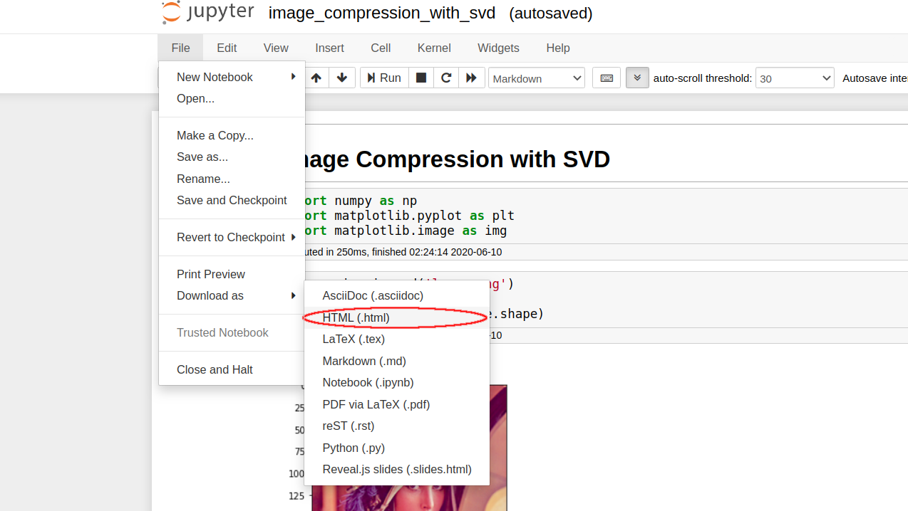

Jupyter Notebook is a good tool for studying and solving problems. In this tutorial, we are going to embed our Jupyter Notebooks into Jekyll posts easily. It is possible to keep original look of the notebook and embed multiple notebooks.


## Setup Layout

Add these lines to `_layouts/post.html` before `<article>` section. You just need to do this configuration only once. 

```html
<script>
  function resizeIframe(obj) {
    obj.style.height = obj.contentWindow.document.documentElement.scrollHeight + 50 + 'px';
  }
</script>
```


## Save the Notebook as HTML File

As the first thing to do, save your notebook as `.html` file. In Jupyter, save the file with clicking; `File -> Download as -> HTML (.html)`. This file includes everything needed such as images, animations, figures, etc. Save this file into `notebooks` folder in your Jekyll project.

<center></center>


## Embed the HTML File

Add these lines to `_posts/2020-1-1-Example-Post.md`, or where you want to embed the notebook:
```markdown
<br>
<iframe src="../notebooks/example_notebook.html" width="100%" height="100%" scrolling="no" onload="resizeIframe(this)"></iframe>
```


## Example Embedding

This section has an example embedding located below:

<br>

<iframe src="../notebooks/example_notebook.html" width="100%" height="100%" scrolling="no" onload="resizeIframe(this)"></iframe>


## Reference

- [https://stackoverflow.com/questions/9975810/make-iframe-automatically-adjust-height-according-to-the-contents-without-using](https://stackoverflow.com/questions/9975810/make-iframe-automatically-adjust-height-according-to-the-contents-without-using)
